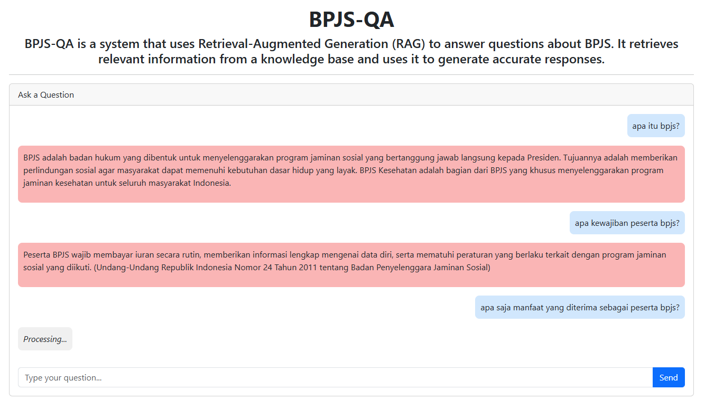

# BPJS-QA

A simple QA of BPJS using Retrieval Augmented Generation (RAG).



## Installing `uv`

Install uv with our standalone installers:

```
# On macOS and Linux.
curl -LsSf https://astral.sh/uv/install.sh | sh
```

```
# On Windows.
powershell -ExecutionPolicy ByPass -c "irm https://astral.sh/uv/install.ps1 | iex"
```

Or, from PyPI:

```
# With pip.
pip install uv
```

```
# Or pipx.
pipx install uv
```

## Running the project

- Clone the project using command `git clone <repository>`
- Add `.env`
  ```
  MYSQL_HOST=
  MYSQL_PORT=
  MYSQL_USERNAME=
  MYSQL_PASSWORD=
  MYSQL_DATABASE=
  MYSQL_CERT_PATH=
  OLLAMA_HOST=
  OLLAMA_MODEL=
  OLLAMA_API_URL=
  SENTENCE_TRANSFORMER_MODEL=
  ```
- Create folder `data` and add `bpjs_kb.csv`
- Install libraries using command `uv sync`
- Run the command `flask --app app.py --debug run`
